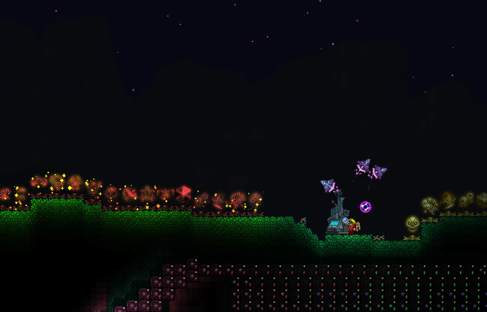

<h1 align="center" style="font-family: 'Poppins', sans-serif; color: #4A4A4A;"> Hi there! 👋</h1>

I'm a second-year university student with a passion for full-stack development. 
My interests lie in web development, software engineering, and building AI systems.  

<h2 align="center" style="font-family: 'Poppins', sans-serif; color: #4A4A4A;">Terrarian Yeah!</h2>

  

<!--

-->

---

<h2 align="center" style="font-family: 'Poppins', sans-serif; color: #4A4A4A;">Technologies I Use</h2>

  
  
  
 
  
  
  
   
  
  
  
   
  

---

<h2 align="center" style="font-family: 'Poppins', sans-serif; color: #4A4A4A;">Editor</h2>

  
 
  

---

<h2 align="center" style="font-family: 'Poppins', sans-serif; color: #4A4A4A;">GitHub Stats</h2>

  
  

---

<h2 align="center" style="font-family: 'Poppins', sans-serif; color: #4A4A4A;">Contributions</h2>

  

---

<h2 align="center" style="font-family: 'Poppins', sans-serif; color: #4A4A4A;">Trophies</h2>

  

---

<h2 align="center" style="font-family: 'Poppins', sans-serif; color: #4A4A4A;">Extras</h2>

  

<!-- Add this to the head of your HTML file -->
<link href="https://fonts.googleapis.com/css2?family=Poppins:wght@300;400;500&display=swap" rel="stylesheet">
